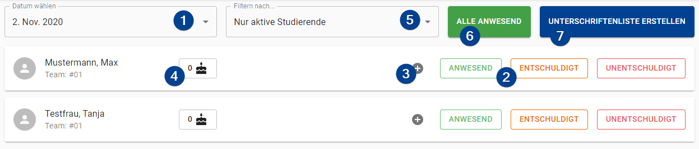

import Roles from '../../src/components/roles/Roles';
import IconInText from '../../src/components/icon-in-text/IconInText';
import PlusIcon from './assets/icons/plus-circle.svg';
import NoteIcon from './assets/icons/note-text.svg';

<Roles roles={['tutor']} />

## Change Attandance State

To change the attendance state of a student you have to select the date first. Afterwards you can click on the desired state. If you want to change the state just click on another one, if you want to remove the state completly just click on the already selected state again.

:::tip
By clicking the "All present" button all students which do _not_ have an other state already will be set to "present".
:::

## Add / Change a Note

To add or change a note related to the attendances of a student click the small plus icon <IconInText icon={PlusIcon} /> on the left of the attendance options. A small dialog will open up and you can enter the note. To save the note click on the "Save" button. You can view the note by clicking on the note icon <IconInText icon={NoteIcon} /> which displays the note in a dialog. From here you can edit the note if necessary.

:::note How to remove a Note
If you want to remove the note just edit the old one and remove all text present in the text field. After saving the note will be removed.
:::

## Page Overview

1. **Date Selection**: Select the date to change attendances for.

1. **Attendance Options**: Choose the attendance option that fit the attendance state of the student. You have the following attendance options:

    - `Present`: The student counts as present for the corresponding criteria.

    - `Excused`: The student was not present but had an excuse. He/She will count as present for the criteria.

    - `Unexcused`: The student was not present and hand no excuse for it. He/She will _not_ count as present for the criteria.

1. **Add / Change a Note**: Add or change a note. You can find more information above.

1. **Cake Counter**: If you use the "cake rule" you can track how many cakes a student still has to bring with him/her.

1. **Student Filter**: You can filter the student by one of the following three options:

    - `Only active students`: The list of students will only show students which are considered "active".

    - `Active & with schein`: The list of students will show all "active" students and all students which already have a schein.

    - `All`: The list of students will show all students regardless of their status.

1. **All Present**: All students without an attendance state for the day are assigned the `Present` state.

1. **Print Signature List**: Create a PDF with the names of all students together with a field for their signature. You can use this if students need to mark of their appearences in the tutorials.
