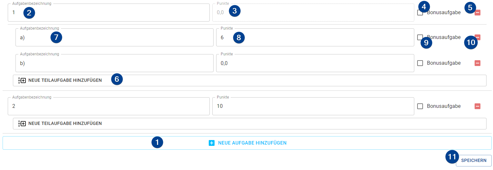

import Roles from '../../src/components/roles/Roles';
import IconInText from '../../src/components/icon-in-text/IconInText';
import MenuIcon from './assets/icons/dots-vertical.svg';

<Roles roles={['admin', 'employee']} />

## Create a Hand-In

To add a new hand-in click the "+ New" button in the upper right. Each hand-in has a slightly different form (see below in the [hand-in types](#hand-in-types)). However, all three hand-in forms use the same form for their exercises.

1. **Add Exercise**: Add a new exercise to the sheet.

1. **Exercise Name**: Name of the exercise on the hand-in.

    :::note
    Will be automatically set on each new exercise but can be changed.
    :::

1. **Total Points**: The total points of the exercise.

    :::note
    This is only needed and editable if the exercise does **not** have any subexercises.
    :::

1. **Bonus Exercise**: Mark this exercise as bonus exercise. While students can gain points in bonus exercises the total points of a bonus exercise are **not** added to the total points of the sheet.

1. **Remove Exercise**: Remove the exercise from the sheet.

    :::caution
    There will be **no** confirmation prompt.
    :::

1. **Add Subexercise**: Add a new subexercise to this exercise.

1. **Subexercise Name**: Name of the subexercise.

1. **Subexercise Points**: The total points of the subexercise.

1. **Bonus Subexercise**: Mark this subexercise as a bonus. The total points of the subexercise will **not** be added to the total points of the exercise if it's a bonus subexercise.

1. **Remove Subexercise**: Remove the subexercise from the exercise.

1. **Save**: Save the hand-in.

## Hand-In Types

### Exercise Sheet

An exercise sheet is used for the _Sheet_ criterias and has the following two form inputs:

1. **Sheet Number**: The number of the sheet.

    :::note
    On opening the creation form this number is automatically set but can be changed.
    :::

1. **Bonus Sheet**: Mark the sheet as bonus. While students can pass it (or gain points on it) it is not added to the number of sheets a student has to pass (or to the total number of points available).

### Short Test

:::tip
If you import the results of a new short test (see [Import Short Tests Results](#import-short-test-results) below) a new short test is automatically created during the import process.
:::

A short test is used for the _Short Test_ criteria and has the following two inputs:

1. **Short Test Number**: The number of the short test.

    :::note
    On opening the creation form this number is automatically set but can be changed.
    :::

1. **Percentag to pass**: The percentage of the points needed to pass the test.

#### Additional menu option

If you click on the menu button <IconInText icon={MenuIcon} /> you can select the additional option "re-import results". This lets you re-import already imported results (ie if the results where inaccurate at the first time) without re-creating the short test.

### Scheinexam

A scheinexam is used for the _scheinexam_ criteria and has the following three inputs:

1. **Scheinexam Number**: The number of the scheinexam.

    :::note
    On opening the creation form this number is automatically set but can be changed.
    :::

1. **Percentag to pass**: The percentage of the points needed to pass the scheinexam.

1. **Date**: The date of the scheinexam. This is only used to display additional information on the PDF containing the results.

#### Additional menu option

If you click on the menu button <IconInText icon={MenuIcon} /> you can select the additional option "results". This will create a PDF containing the results of the students for the scheinexam. By default the PDF contains a table with the masked matriculation numbers of the students and their result ("passed" / "not passed").

## Change a Hand-In

To edit a hand-in click the menu button <IconInText icon={MenuIcon} /> on it's bar and choose "Edit". The form that opens up is the same one as for the process of creating a hand-in ([see above](#create-a-hand-in)).

## Delete a Hand-In

To delete a hand-in click the menu button <IconInText icon={MenuIcon} /> on it's bar and choose "Delete". A confirmation dialog opens up if you really want to delete the hand-in.

:::warning No restore possible
Deleting a hand-in is **permanent**! Deleted hand-ins can **NOT** be restored and gradings related to it are **lost**!
:::

## Short Test Results

### Import new results

To import short test results from the Ilias system you can use the import wizard by clicking on the "Import new results" button in the upper right on the short test page. Follow the step-by-step wizard which opens up.

1. **Import CSV content**: You can choose between two modes to import the CSV content into the system by clicking on the corresponding button. Also, you can set the separator used in the CSV data set. If you leave the seperator empty the TMS will try to figure out the used seperator automatically.

    1. _File mode_ (default): You select a CSV file from your disk (either by clicking on the upload button or with drag & drop onto that button). The content of this file will get send to and parsed by the TMS server by clicking on the "Next" button (upper right).
       :::note Use the correct file
       Make sure to export the correct CSV file. There is only one file that contains the results and the Ilias names. For more information click the "Export results" button in the upper left of the page (below the title).
       :::

    1. _Text mode_: You copy the contents of the CSV file into the textfield. The content gets send to and parsed by the server by clicking on the "Next" button (upper right).

1. **Map Columns**:

    1. **Required static columns**: The TMS tries to find the three required columns automatically. It needs the Ilias name and the test results of the students together with the total results. If the columns are not properly detected you can change them through the dropdown menus on this page.

    1. **Exercise result columns**: At the bottom of the page you find a small form to specify the exercise columns. You enter the _amount_ of exercises and whether the TMS should get those columns from the end or the start of the table. After clicking "Accept" you can verify and/or change the identified columns. Furthermore you can add and/or delete more columns which resemble exercises.

        :::note
        By default, the Ilias puts the columns with the results of the exericses at the end of the generated table.
        :::

1. **Map Ilias names**:
   If the CSV file contains any Ilias names which could not be find in the TMS system you can manually map those names to students (these mappings will only be used for this import process).
   By clicking on the "Map student" button you get a list of all students which are not already mapped to an ilias name (here you can find the tutorial they are in, too).

1. **Adjust Short Test**:
   The TMS tries to generate a short test from the given information.
   It uses the columns used earlier to try and figure out the points each exercise gives.
   However, due to those information not available inside the CSV the TMS can only _guess_ the points by using the maximum points any student has achieved in the exercise.
   This can result in a short test that is not 100% correct and you have to adjust the exercises.
   The TMS will warn you if the total points of the test given by the CSV and the total points of the generated one are not equal.

    :::caution
    You cannot continue until the total points in the generated test are the same as the total points of the actual test.
    :::

1. **Finish the import**:
   By clicking "Done" the TMS will create a new short test based on the CSV file and your input.
   Afterwards it will add a grading to each student which has an ilias name inside the CSV dataset.
   This last part might take a few seconds to complete.

### Re-import / Change results

To re-import results of a short test (ie because they have changed) you can basically follow the steps above.
However, you must enter the wizard by clicking on "Re-import results" inside the additional options menu of the short test you want to re-import the results of.
Please note that you have to enter some information again even though you already entered them while importing the results the first time:

-   Amount of exercises in the test in the step "Map Colums"
-   Mapping of ilias names (if ilias names where not added in the meantime).

:::caution
The TMS currently does NOT check if the CSV data set complies to the already existing short test.
:::
