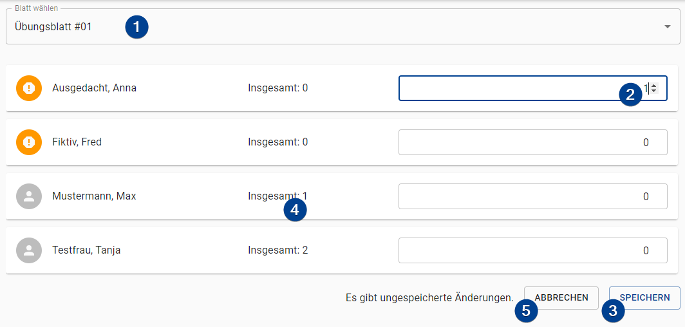

import Roles from '../../src/components/roles/Roles';

<Roles roles={['tutor']} />

To change the presentations a student has made you have to follow step (1) to (3):

1. **Sheet Selection**: Select the sheet the student has presented a solution for.

1. **Presentation Points**: Enter the amount of presentation points the student has gained for the selected sheet.

   :::note
   You can enter the presentation points for multiple students at once and only save one time in the end.
   :::

1. **Save**: Save the changes.

1. **Total points**: Displays the total points a student has throughout all sheets.

1. **Abort**: Resets form to the last saved state.
