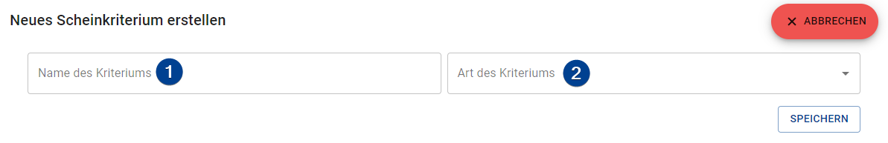
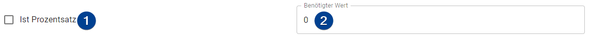
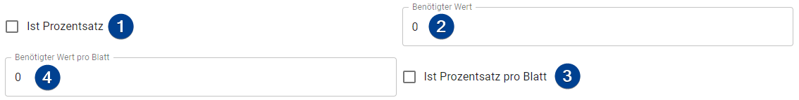
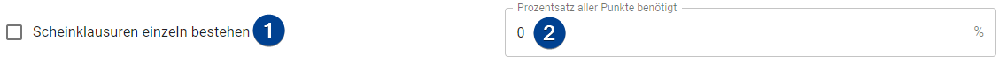

import Roles from '../../src/components/roles/Roles';
import IconInText from '../../src/components/icon-in-text/IconInText';
import MenuIcon from './assets/icons/dots-vertical.svg';

<Roles roles={['admin', 'employee']} />

## Add a Scheincriteria

To add a criteria click on the "+ Add" button in the upper right. A form with two input opens up (see below). Please note that it is possible to add two types of the same criteria however all criterias are linked together with a logic "AND" (therefore the students have to pass _all_ criterias). Make sure that your criterias do not contradict themselfs.

1. **Name**: A name for your criteria.

1. **Type**: Select the type of the criteria. Depending on which one you select the rest of the form looks slightly different. You can find a description of all criterias below.

## Change a Scheincriteria

To change a criteria click on the menu icon <IconInText icon={MenuIcon} /> on the right of the row of the criteria. Select "Edit" from the menu that opens up. A dialog pops up which contains a form in which you can change the data of the selected criteria.

:::note
You can **not** change the type of a criteria by editing it.
:::

## Delete a Scheincriteria

To delete a criteria click on the menu icon <IconInText icon={MenuIcon} /> and select "Delete" from the menu. Confirm the prompt asking you if you really want to delete the criteria.

## Criteria Types

There are several criteria types available in the TMS. Each type will be described and it's form will be explained.

:::note Messy Forms
The forms are not as intuitiv as they could be due to the fact that they are automatically generated from the actual TypeScript types. They will get redesigned at some point in the future.
:::

### Attendances

A student has to attend his/her tutorial for a specified amount of times. This can either be an absolute (ie "Student has to visit 5 times") or a percentage (ie "Student has to visit 80% of all times").

1. **Is Percentage**: If checked the number in the "Amount" (2) field is considered a percentage. If not the number is considered an absolute value.

   :::caution
   If the field already has a value in checking this box might lead to you having to adjust the value (ie "5" -> "500%").
   :::

1. **Amount**: The amount of times a student has to be present. It's an absolute value by default, you can change it by checking the "Is Percentage" checkbox (1).

### Sheets (single)

The student needs to pass a certain number of homeworks. Each homework is considered "passed" if the student scores a certain number of points in it. Both numbers can be either absolute or a percentage.

1. **Is Percentage**: If checked the number in the "Amount" (2) field is considered a percentage. If not the number is considered an absolute value.

   :::caution
   If the field already has a value in checking this box might lead to you having to adjust the value (ie "5" -> "500%").
   :::

1. **Amount**: The amount of homeworks a student has to be pass. It's an absolute value by default, you can change it by checking the "Is Percentage" checkbox (1).

1. **Is Percentage Per Sheet**: If checked the number in the "Amount" (4) field is considered a percentage. If not the number is considered an absolute value.

   :::caution
   If the field already has a value in checking this box might lead to you having to adjust the value (ie "5" -> "500%").
   :::

1. **Amount Per Sheet**: The amount of points a student has to score on each sheet to pass it. It's an absolute value by default, you can change it by checking the "Is Percentage" checkbox (3).

### Sheets (total)

The student needs to score a certain amount of points in all homeworks together. The amount can either be an absolute (ie "The student scores 42 points in total") or a percentage value (ie "The students has to score 50% of all points").

1. **Is Percentage**: If checked the number in the "Amount" (2) field is considered a percentage. If not the number is considered an absolute value.

   :::caution
   If the field already has a value in checking this box might lead to you having to adjust the value (ie "5" -> "500%").
   :::

1. **Amount**: The amount of points a student has to be score in total. It's an absolute value by default, you can change it by checking the "Is Percentage" checkbox (1).

### Scheinexam

If there are one or more Scheinexams this criteria defines how they are evaluated. There are basicly two modes:

- `All together`: The student needs a certain percentage of all points summed through all scheinexams.

  :::note Example
  You have 2 scheinexams, the first with a total of 30 and the second with a total of 40 points. The percentage needed is 50%. Therefore, the student has to score 35 points in both scheinexams _together_.
  :::

- `Each exam individually`: The students needs a certain percentage of the points in each scheinexam.

  :::note Example
  You have 2 scheinexams, the first with a total of 30 and the second with a total of 40 points. The percentage needed is 50%. Therefore the students has to score 15 points in the first and 20 points in the second exam.
  :::

### Short Tests

The student has to pass a certain number of short tests. Each short test is considered passed if the student has achieved a certain number of points in it. Both numbers can be either absolute or a percentage.

1. **Is Percentage**: If checked the number in the "Amount" (2) field is considered a percentage. If not the number is considered an absolute value.

   :::caution
   If the field already has a value in checking this box might lead to you having to adjust the value (ie "5" -> "500%").
   :::

1. **Amount**: The amount of short tests a student has to be pass. It's an absolute value by default, you can change it by checking the "Is Percentage" checkbox (1).

1. **Is Percentage Per Sheet**: If checked the number in the "Amount" (4) field is considered a percentage. If not the number is considered an absolute value.

   :::caution
   If the field already has a value in checking this box might lead to you having to adjust the value (ie "5" -> "500%").
   :::

1. **Amount Per Sheet**: The amount of points a student has to score on each short test to pass it. It's an absolute value by default, you can change it by checking the "Is Percentage" checkbox (3).

### Presentations

A student has to present his/her solutions a certain amount of times. Only absolute values are possible.

1. **Amount**: Indicates how often a student has to present his/her solution.
