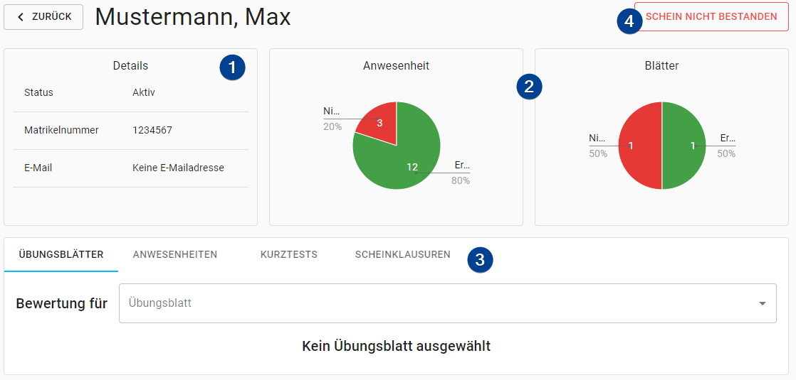

import Roles from '../../src/components/roles/Roles';
import IconInText from '../../src/components/icon-in-text/IconInText';

<Roles roles={['tutor']} />

You can find the following information about the student on this page.

1. **Details**: Current state, matriculation number, e-mail and ilias name are being displayed here (or a label indicating that the corresponding information is not saved.).

1. **Criteria progress**: The current progress or state of the criterias. Each criteria is represented by a pie chart which has a "passed" and "not passed" section. The number of charts is determined by the number of criterias that exist in the configuration of your TMS instance (ie if there is no attendance criteria defined the pie chart resembling attendances would not be shown).

1. **Gradings & Attendances**: Gradings for sheets, short tests and scheinexams are being shown here aswell as the attendances of the student. After selecting a hand-in the gradings show the achieved points on the left and the rendered markdown on the right (ie as it would appear in the PDF).

    :::note
    Attendances can be changed here but gradings can **not**.
    :::

1. **Current Schein State**: Shows if the student has passed all relevant criterias for the schein _at the moment_.

    :::caution Current state only
    This is the state the student would have if the term would end _right now_. Especially sheet & short test evaluations might be off because the TMS might not know how many sheets there would be in total.
    :::
