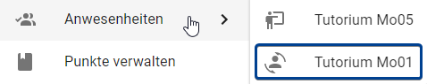
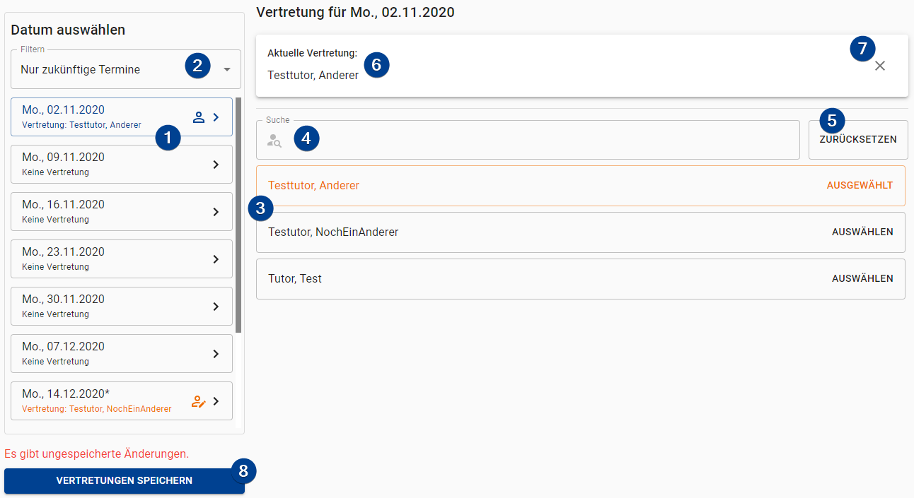

import IconInText from '../../src/components/icon-in-text/IconInText';
import Roles from '../../src/components/roles/Roles';
import SubstituteIcon from './assets/icons/account-convert.svg';
import DateHasSubstituteIcon from './assets/icons/account-outline.svg';
import EditedIcon from './assets/icons/account-edit-outline.svg';
import RemoveIcon from './assets/icons/close.svg';

<Roles roles={['tutor']} />

## Access Substituted Tutorials

If you are assigned as a substitute to a tutorial, you get access to it's "Attendance" and "Presentation" page. You access those pages through the submenu on your sidebar (see image below). Tutorials in which you are a substitute are marked with the substitute icon <IconInText icon={SubstituteIcon} />.

## Assign a Substitute

To assign a substiute for one of your own tutorials go to the "Substitute" page. First, you have to select the date you want to assign a substitute for. Afterwards you have to select the substitute tutor from the list presented. As a final step you have to save your changes. You can find an explanation of all elements on that page below.

:::tip Multiple dates
You can assign substitute for multiple dates and only save once in the end.
:::

1. **Dates**: Select the date you want to add / change / remove the substitute of. The list shows a substitute icon <IconInText icon={DateHasSubstituteIcon} /> if the date has a substitute. An edited icon <IconInText icon={EditedIcon} /> is shown if the date has unsaved changes.

1. **Date Filter**: You can filter the dates shown:

   - "Only future dates" _(default)_: Only show dates that are in the future (the current day is also shown).
   - "All dates": Show all available dates.
   - "Without substitute": Show all dates which do _not_ have a substitute assigned.
   - "With substitute": Show all dates which have a substitute assigned.

1. **List of Tutors**: A list of all other tutors is shown. Choose the one you want to assign by clicking on the entry.
   :::caution
   The list does **not** hide tutors that already have a tutorial!
   :::

1. **Tutor Search**: Enter a name (case insensitive) to search for the tutor. Only tutors who's names match the entry are shown in the list below.

1. **Reset**: Resets the substitute of the day to the point which was saved last.

1. **Current Substitute**: Shows the currently assigned substitute for the day. If no substitute is assigned the bar is hidden.

1. **Remove Substitute**: Remove the substitute from the date.

1. **Save**: Saves the changes for _all_ dates.

## Remove a Substitute

If you want to remove an assigned substitute select the date you want to remove the substitute from. Afterwards click on the small <IconInText icon={RemoveIcon} /> on the right of the selected tutor at the top (marked with `7` in the image above). Remember to hit the save button in the end.
