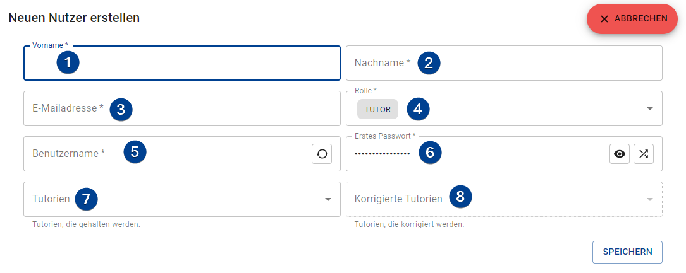

import Roles from '../../src/components/roles/Roles';
import IconInText from '../../src/components/icon-in-text/IconInText';
import MenuIcon from './assets/icons/dots-vertical.svg';
import GenerateIcon from './assets/icons/table-arrow-down.svg';
import EditIcon from './assets/icons/square-edit-outline.svg';
import ResetIcon from './assets/icons/undo.svg';
import RestoreIcon from './assets/icons/restore.svg';
import ViewPasswordIcon from './assets/icons/eye.svg';
import RandomizePasswordIcon from './assets/icons/shuffle.svg';

<Roles roles={['admin']} />

## Create User

To create a new user click on the "+ New" button in the upper right of the page. Fill out the form as described below to create a new user.

1. **Firstname**: The firstname of the user.

1. **Lastname**: The lastname of the user.

1. **E-Mail**: A valid e-mail address of the user. Used to send the credentials to if mailing is configured (see [_Provide Credentials_](#provide-credentials) on this page).

1. **Roles**: All roles of the user.

1. **Username**: The username of the user. Gets auto-generated from the last- and firstname. If you changed the username and want to restore the auto-generated one just click on the restore button <IconInText icon={RestoreIcon} />.

1. **First Password**: The initial password of the user. If not changed it is randomly generated. To view the entered or generated password click on the "Toggle clear text" button <IconInText icon={ViewPasswordIcon} /> and to generate a new password click on the generate button <IconInText icon={RandomizePasswordIcon} />.

1. **Tutorials**: All tutorials the user holds. Is disabled if the user does not have the `TUTOR` role.

1. **Tutorials to correct**: All tutorials the user is a corrector of. Is disabled if the user does not have the `CORRECTOR` role.

## Provide Credentials

Users need their initial credentials to log in for the first time. There are multiple ways to provide the initial credentials to your users:

-   **Send per E-Mail**: By clicking on "Send credentials" all users get an e-mail with their username and initial password. Also, you can send the credentials to a single user only by clicking on the menu button <IconInText icon={MenuIcon} /> on their bar and selecting "Send credentials".

    :::tip Custom E-Mail
    You can customize the e-mail by changing the template used for the mails. For more information read the [_Configuration Page_](../setup/configuration#mail-template) in the server setup.
    :::

    :::note Availability
    These options are only available if the mailing is configured in the [_Settings_](./settings).
    :::

-   **Hand out**: By clicking "Print credentials" the TMS generates a PDF with a table containing the usernames and the initial passwords. You could cut out the credentials and hand them to your users.

    :::warning
    The passwords are **clearly readable**! Make sure that only the user gets the credentials belonging to him/her.
    :::

## Import Users

To import users from a CSV file click on the "<IconInText icon={GenerateIcon} /> Generate" button in the upper right. A step-by-step wizard will guide you through the import process.

1. **Import CSV content**: Import the CSV content by either copy & paste the content in the input field or by uploading the file. You can upload the file by clicking the "Upload CSV-file" button and the content will be pasted into the input field after uploading. If the separator is not correctly detected on the next page you can change the seperator on _this_ page using the "Separator" input in the upper right.

    :::tip Drag & Drop
    You can also drag & drop the file on the button
    :::

1. **Map Columns**: The TMS tries to find all needed columns automatically. If the columns are not properly detected you can change them through the dropdown menus on this page. The following columns are supported (_required_ ones must be provided):

    - _Firstname (**required**)_: The firstname of the user.

    - _Lastname (**required**)_: The lastname of the user.

    - _E-Mail Address (**required**)_: A valid e-mail address of the user. Used to send the credentials to if mailing is configured (see [_Provide Credentials_](#provide-credentials) on this page).

    - _Roles_: All roles of the user. If provided must be a comma-separated list of [_Roles_](./roles) supported by the TMS. If not provided the user only gets assigned the `TUTOR` role.

    - _Tutorials_: All tutorials the user holds. Must be a comma-separated list of _Slot names_ of already existing tutorials.
      :::caution Role
      If the user holds tutorials he/she also needs the `TUTOR` role.
      :::

    - _Tutorials to correct_: All tutorials the user is a corrector of. Must be a comma-separated list of _Slot names_ of already existing tutorials.
      :::caution Role
      If the user corrects tutorials he/she also needs the `CORRECTOR` role.
      :::

    - _Username_: The username of the user. If not provided a proper username will be generated by the TMS.
      :::caution Unique
      If you provide usernames for your users make sure that they are unique.
      :::

    - _Password_: The inital password of the user. If not provided a randomly generated password will be used.

1. **Review User Data**: You can review the users that would be generated by the system. If you need to change information click on the edit button <IconInText icon={EditIcon} />. If you want to reset your changes click on the reset button <IconInText icon={ResetIcon} />.

## Edit User

To edit an user click the menu button <IconInText icon={MenuIcon} /> on their bar and choose "Edit". The form that opens up is the same one as for the process of creating an user ([see above](#create-user)), however, the password field will be blank.

### Change Password

The password of a user will be changed if the password field is **not** empty on editing a user. If it is empty the passwort will be kept.

## Delete User

To delete an user click the menu button <IconInText icon={MenuIcon} /> on their bar and choose "Delete". A confirmation dialog opens up if you really want to delete the user.

:::warning No restore possible
Deleting an user is **permanent**! Deleted users can **NOT** be restored.
:::
